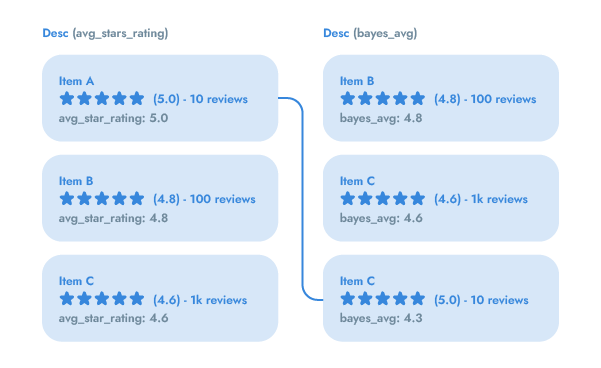

# Bayesian Average

A Bayesian average is a method of estimating the mean of a population using outside information, especially a pre-existing belief, which is factored into the calculation. To understand if the Bayesian average is right for you, let's look at two ways to rank star ratings:


- Use an arithmetic average that adds together all ratings and divides them by the total quantity of ratings. If there are 100 1-star ratings and 10 5-star ratings, the calculation is ((100x1) + (10x5))/ (100+10) = 1.36.
- Use a [Bayesian average](https://en.wikipedia.org/wiki/Bayesian_average) that adjusts a product’s average rating by how much it varies from the catalog average. This favors products with a higher quantity of ratings.
As already suggested, ignoring the quantity of ratings doesn’t help distinguish between items with 10 ratings and 1000 ratings. You need to at least calculate an average that includes the quantity of ratings.

The following image shows three items ranked by different averages. The left side uses the arithmetic average for ranking. The right side uses the Bayesian average.




Both sides display the arithmetic average in parenthesis just right of the stars. They also display the average used for ranking as `avg_star_rating` and `bayes_avg` respectively, under each item.

By putting Item A at the top, the left side’s ranking is both misleading and unsatisfying. The ranking on the right, based on the Bayesian average, reflects a better balance of rating and quantity of ratings. This example shows how the Bayesian average lowered item A’s average to 4.3 because it measured A’s 10 ratings against B and C’s much larger numbers of ratings. As described later, the Bayesian average left Items B and C unchanged because the Bayesian average affects items with low rating counts much more then those that have more ratings.

In sum, by relativizing ratings in this way, the Bayesian average creates a more reliable comparison between products. It ensures that products with lower numbers of ratings have less weight in the ranking.


## Understanding the Bayesian average

The Bayesian average adjusts the average rating of products whose rating counts fall below a threshold. Suppose the threshold amount is calculated to be 100. That means average ratings with less than 100 ratings get adjusted, while average ratings with more than 100 ratings change only very slightly. This threshold amount of 100 is called a confidence number, because it gives you confidence that averages with 100 or more ratings are more reliable than averages with less than 100 ratings.

This confidence number derives from the catalog’s distribution of rating counts and the average rating of all products. By factoring in ratings counts and averages from the whole catalog, the Bayesian average has the following effect on an item’s individual average rating:

- For an item with a fewer than average quantity of ratings, the Bayesian average lowers its artificially high rating by weighing it down (slightly) to the lower catalog average.
- For an item with a lot of ratings (that is, more than the threshold), the Bayesian average doesn’t change its rating average by a significant amount.


## Installation

You can install the Bayesian average into your project using the [Composer](https://getcomposer.org/) package manager:

```bash
composer require assisted-mindfulness/bayesian-average
```


## Usage

Create an instance of the `AssistedMindfulness\BayesianAverage\BayesianAverage` class.

```php
// Item with a large number of ratings
$itemLargeRating = collect(range(0, 500))->transform(fn () => random_int(4, 5));
$itemLargeRatingAverage = $itemLargeRating->avg();
$itemLargeRatingCount = $itemLargeRating->count();

$c = 100; // Confidence number
$m = 3.5; // Catalog average

$bayes = new BayesianAverage();
$bayes
    ->setConfidenceNumber($c)
    ->setAverageRatingOfAllElements($m);

$bayes->getAverage($itemLargeRatingAverage, $itemLargeRatingCount); // ~4.3
```

The confidence number is set by one of the following methods:
- `setConfidenceNumber(int|float $confidenceNumber)`: will set the passed argument to a confidence number.
- `setConfidenceNumberForEvenOrOdd(int $count, callable $even, callable $odd)`: In case of an even `$count` (number of elements), will set the result of executing `$even` as a confidence number; if `$count` is odd, the confidence mean will be set to the result of running `$odd`.


### Example


Computing the Bayesian mean using an array as an example.

```php
$data = collect([
    [
        'name'          => "Item A",
        "ratings"       => [5, 4, 3, 4, 3, 2, 4, 3],
        'ratings_count' => 8,
    ],
    [
        'name'          => "Item B",
        "ratings"       => [4, 5, 5, 5, 5, 5, 5, 5, 4],
        'ratings_count' => 9,
    ],
    [
        'name'          => "Item C",
        "ratings"       => [5],
        'ratings_count' => 1,
    ],
]);

$allRatingsCount = $data->sum('ratings_count');
$sum = $data->sum(fn($item) => array_sum($item['ratings']));

$bayes = new BayesianAverage($allRatingsCount, $sum);

$bayes->setConfidenceNumber(1);

$average = array_sum($data[0]['ratings']) / count($data[0]['ratings']); // 3.5
$bayes_avg = $bayes->getAverage($average, count($data[0]['ratings'])); // 3.5802469135802 
```

Consider using the `setConfidenceNumberForEvenOrOdd` method. Let's set the lower [quartile](https://en.wikipedia.org/wiki/Quartile) as the confidence number.

```php
$bayes = new BayesianAverage($allRatingsCount, $sum);

$bayes->setConfidenceNumberForEvenOrOdd($data->count(), function ($position) use ($data) {
    $item = $data->sortBy('ratings_count')->values()->get($position / 2);

    return $item['ratings_count'];
}, function ($position) use ($data) {
    $item1 = $data->sortBy('ratings_count')->values()->get(($position + 1) / 2);
    $item2 = $data->sortBy('ratings_count')->values()->get(($position - 1) / 2);

    return ($item1['ratings_count'] + $item2['ratings_count']) / 2;
});

$data->each(function ($item) use ($bayes, $sum, $allRatingsCount) {
    $average = array_sum($item['ratings']) / count($item['ratings']);
    $bayes_avg = $bayes->getAverage($average, count($item['ratings']));
    
    printf('Average = %s, Bayesian  average = %s', $average, $bayes_avg);
});

/*
 *Average = 3.5, Bayesian  average = 3.5802469135802 
 *Average = 4.7777777777778, Bayesian  average = 4.7222222222222 
 *Average = 5, Bayesian  average = 4.6111111111111 
 */
```


## License

The MIT License (MIT). Please see [License File](LICENSE.md) for more information.
